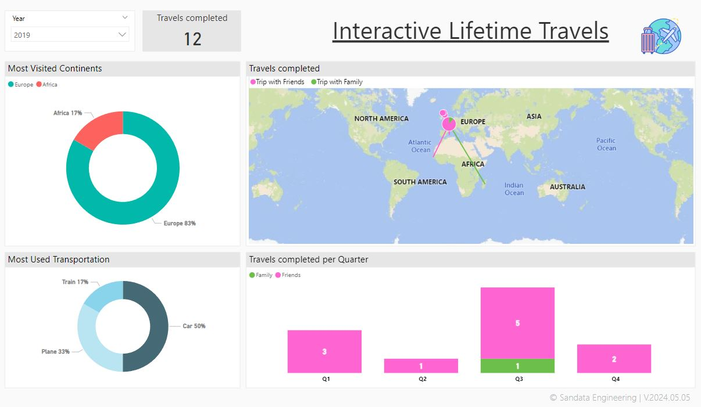
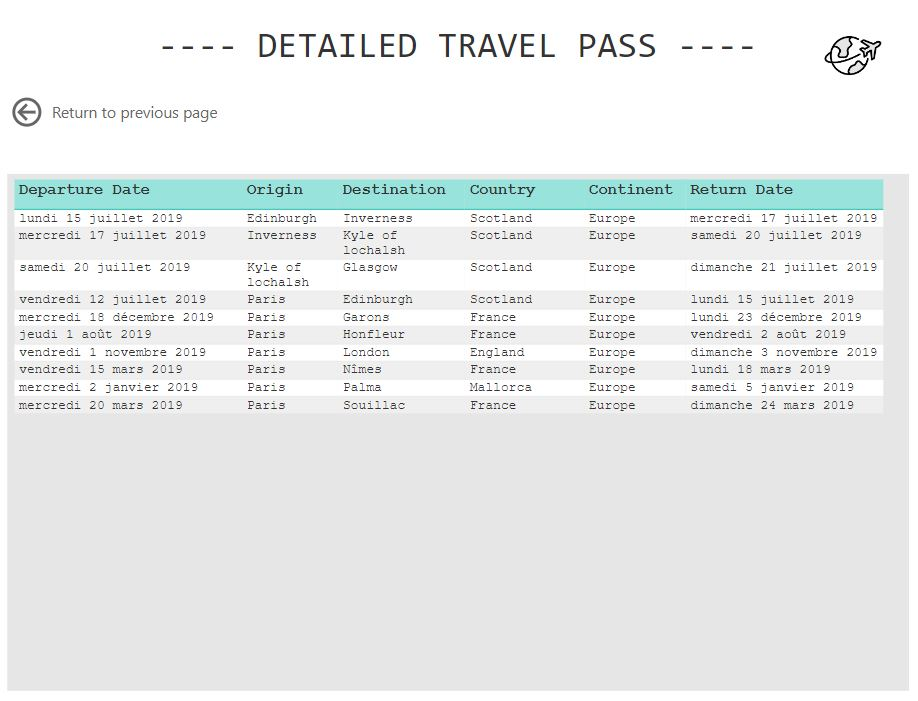

# Interactive Travels Map
Tracking all my completed travels in a Power BI dashboard using Flow map. Go read my detailed blog post here: [Interactive Travels map](https://www.sandata-engineering.com/en/post/interactive-travel-map) 

For this project, the dataset is stored in my personal Google Sheet. [Download the template of the dataset here.](https://docs.google.com/spreadsheets/d/1_DrjIe15Bz7OKdCV8jE8YEg1UblWcdPVyYHUYgFfsHU/edit?usp=sharing)  
  
# Preview of the dashboard

The dashboard is composed of one page: 
- Annual Travels Overview, presents all the travels completed per year

- Detailed tooltip, presents all a detailed table of all the travels

# Additional Resources

- **[Flow map documentation](https://weiweicui.github.io/PowerBI-Flowmap/)**  
- **[How to Power BI tutorial](https://www.youtube.com/watch?v=Zt-3T5bRAeg&t=134s&ab_channel=HowtoPowerBI)**  
